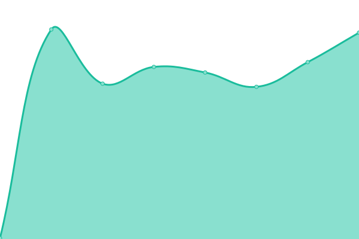
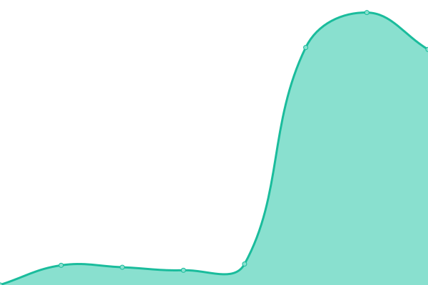

# [📈 Live Status](https://status.repetiti.com): <!--live status--> **🟩 All systems operational**

This repository contains the open-source uptime monitor and status page for [Repetiti.Com](https://www.repetiti.com/), powered by [Upptime](https://github.com/upptime/upptime).

With [Upptime](https://upptime.js.org), you can get your own unlimited and free uptime monitor and status page, powered entirely by a GitHub repository. We use [Issues](https://github.com/Repetiti-Com/repetiti-uptime/issues) as incident reports, [Actions](https://github.com/Repetiti-Com/repetiti-uptime/actions) as uptime monitors, and [Pages](https://status.repetiti.com) for the status page.

<!--start: status pages-->
<!-- This summary is generated by Upptime (https://github.com/upptime/upptime) -->
<!-- Do not edit this manually, your changes will be overwritten -->
<!-- prettier-ignore -->
| URL | Status | History | Response Time | Uptime |
| --- | ------ | ------- | ------------- | ------ |
|  [Repetiti Main Page](https://www.repetiti.com) | 🟩 Up | [repetiti-main-page.yml](https://github.com/Repetiti-Com/repetiti-uptime/commits/HEAD/history/repetiti-main-page.yml) | 

 710ms
     
 | 

<a href="https://status.repetiti.com/history/repetiti-main-page">100.00%</a>
    

|  [Repetiti Panel](https://panel.repetiti.com/login) | 🟩 Up | [repetiti-panel.yml](https://github.com/Repetiti-Com/repetiti-uptime/commits/HEAD/history/repetiti-panel.yml) | 

 495ms
     
 | 

<a href="https://status.repetiti.com/history/repetiti-panel">100.00%</a>
    

|  [Repetiti Api](https://app.repetiti.com) | 🟩 Up | [repetiti-api.yml](https://github.com/Repetiti-Com/repetiti-uptime/commits/HEAD/history/repetiti-api.yml) | 

 3146ms
     
 | 

<a href="https://status.repetiti.com/history/repetiti-api">100.00%</a>
    

<!--end: status pages-->

[**Visit our status website →**](https://status.repetiti.com)

## 📄 License

- Powered by: [Upptime](https://github.com/upptime/upptime)
- Code: [MIT](./LICENSE) © [Repetiti.Com](https://www.repetiti.com/)
- Data in the `./history` directory: [Open Database License](https://opendatacommons.org/licenses/odbl/1-0/)
